# 																Git  NB！

# 1. Git概念

* 相比于普通的分布式版本控制系统(DVCS)，git更像是一个小型数据库同时提供了许多强大的工具。
* .git 文件是git的核心，这个才是真正的git仓库，保存了所有文件历史版本，修改信息等等。
  * 几乎所有已经提交了的内容，即存储在.git仓库中的内容，都是可以恢复的。

* 所谓的工作目录，就是从.git数据仓库里面拿出来的特定版本的文件。

## 1.1 git文件状态图

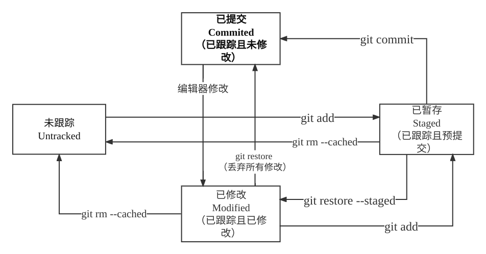

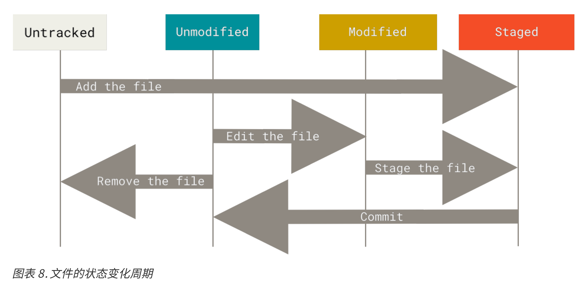


## 1.2 Git的三个区域

* git的最重要的三个区域就是HEAD、INDEX、WD(Working Directory)
  * HEAD指已经提交的最新快照
  * INDEX指已暂存的修改(可以理解为已暂存了的文件版本或者说预提交快照)
  * WD指当前工作目录(可以理解为没提交没暂存的当前快照)
* 所谓干净状态，working tree clean，就是刚提交完没做任何修改，此时 HEAD=INDEX=WD
* 关系图
  * 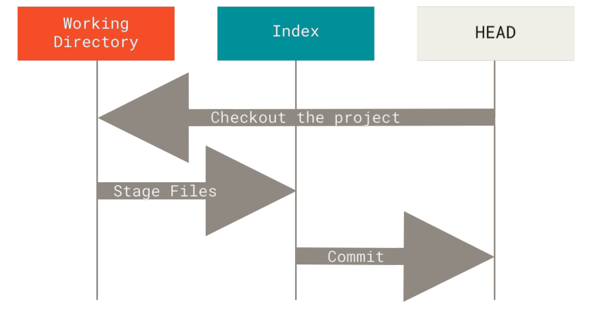

## 1.3 Git分支

### 1.3.1 本地

##### 1. 可提交对象(commit object)

* git每提交一次，就形成一个新的快照，可理解为一个新的文件版本，以下均使用快照一词。

* 可提交对象就是一个数据结构，主要保存三部分内容
  * 提交信息
    * 本次提交的作者，电子邮件，日期，提交说明等等。
  * 快照内容(实际上是保存了指向存储快照内容数据结构的指针)
    * 所有文件的快照
  * 指向父提交对象的指针
    * 以一个文件file1举例， file_v1表示原版文件，file_v1经过修改后提交形成file_v2，那么称存储file_v1的提交对象为存储file_v2的提交对象的父提交对象。
* 因此整个历史提交可以理解成下图.
  * 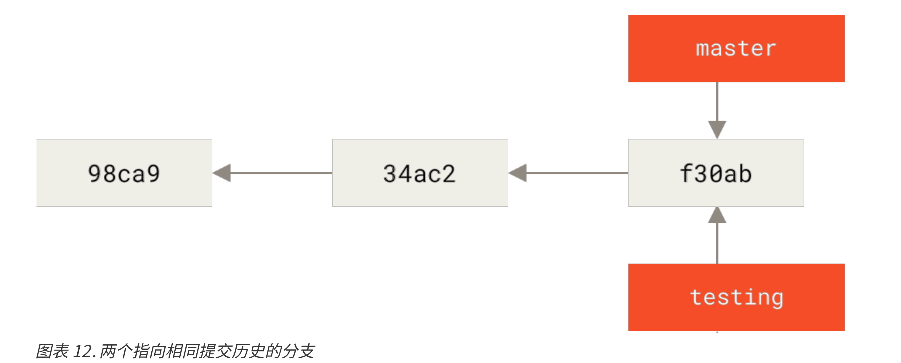
    * 每个米黄色方块代表一个可提交对象，指针表示指向父提交对象。

##### 2. 分支

* Git 的分支，其实本质上仅仅是指向提交对象的可变指针。可变指指针可以指向任意可提交对象。
* 每个仓库建立时默认创建一个master分支，master和其他分支没有任何不同。

##### 3. HEAD 指针

* HEAD指针的值就是当前本地分支。切换分支时HEAD指向新分支。
  * 结合上图，有两个分支，当前处在master分支，那么示意图如下
    * 
    * HEAD指向当前本地分支master
  * 当切换到testing分支时，示意图如下
    * 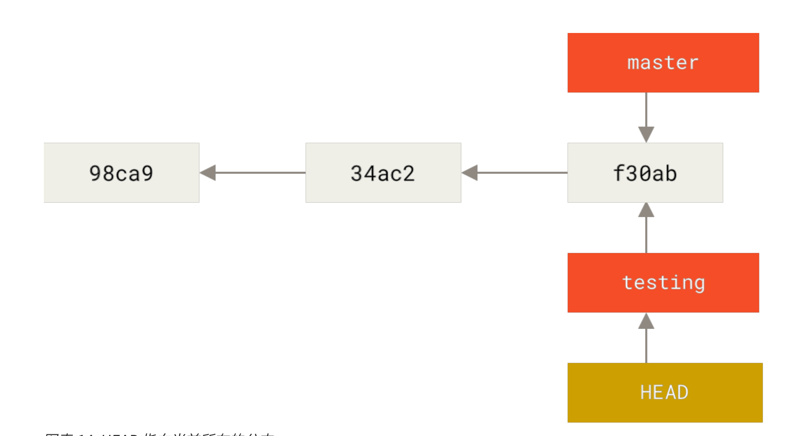
    * 此时HEAD指向当前本地分支testing
* 那么HEAD指针存在的意义是什么呢？
  * 为了能够自动移动指针。如下图testing分支下有了新的提交。示意图如下：
    * 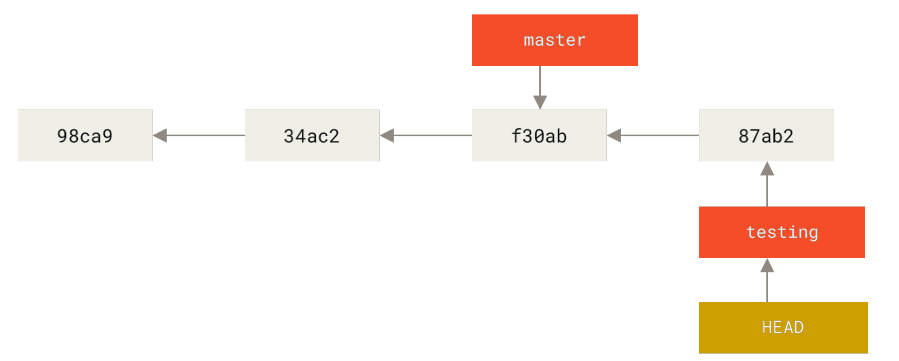
    * master停留不懂，testing指向新提交，HEAD依然指向testing分支。
  * 我猜一下代码实现，假设当前提交对象名为commitObj1。存在两个分支master和testing指向该对象。当前本地分支是master。
    * 那么数据结构就是  master = \&commitObj1   testing = \&commitObj1    HEAD = &master
    * git checkout testing :    master, testing 不变， HEAD = &testing。HEAD永远指向当前分支。
    * 在testing分支下做一些修改，提交生成新提交对象commitObj2。此时自动移动指针：
      * \*HEAD = \&commitObj2  。而不是用testing = \&commitObj2。这样借助HEAD移动分支十分方便，每当在当前分支有了新的提交只需执行\*HEAD = &新Obj即可，而不用关心真正的当前分支叫什么。因为HEAD永远指向当前分支。
    * (为了方便理解，上述假设分支指针保存的是提交对象数据块的地址值，其实实际保存的是提交对象的40位16进制校验码，当然本质一样，都是一个key，通过这个key可以读取提交对象的实际数据内容)
  * 在切回master 
    * 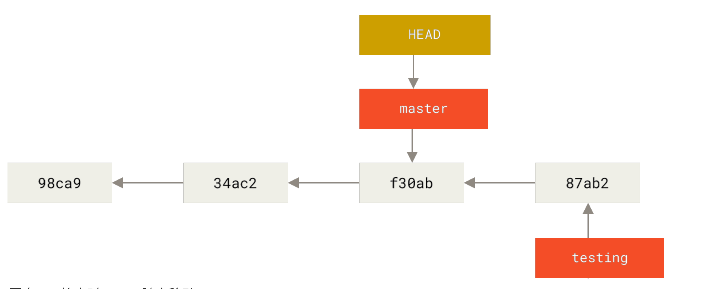
      * **注意切换分支时当前工作目录会发生变化**，当前工作目录的内容是当前分支所指向的可提交对象保存的快照内容。就图而言，刚才在testing分支，工作目录是87ab2提交对象保存的快照内容，现在在master分支，工作目录是f30ab提交对象保存的快照内容。
  * master分支下做些修改
    * 
      * 产生了分叉。

##### 4. 合并分支

* Fast Forward(快速合并)
  * 要合并的分支是当前分支的直接后继。当前分支直接移动到合并分支所指提交对象处
  * 下图是在master分支执行git merge fixBug 前后示意图
    * 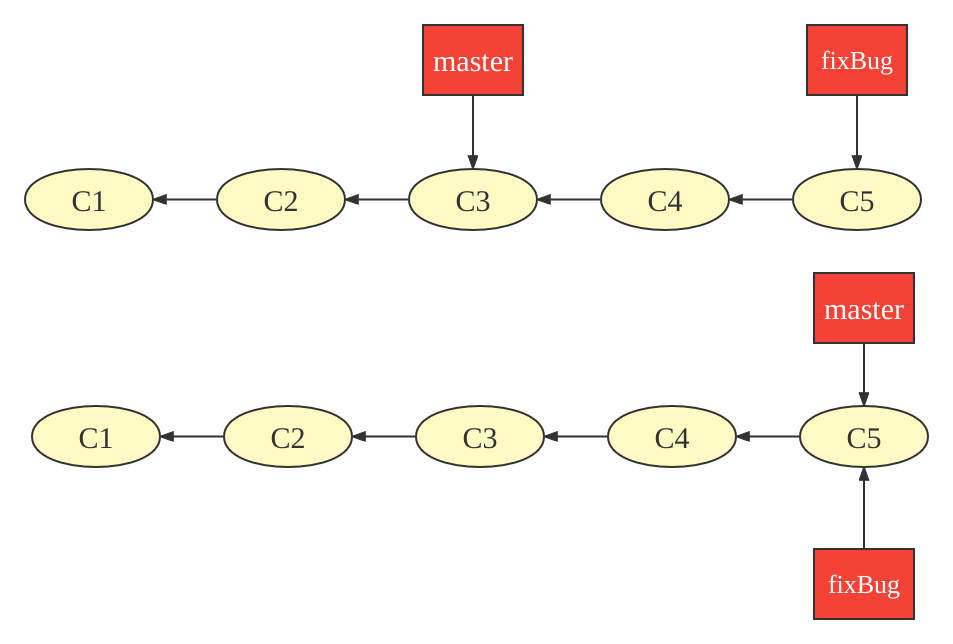
* 三方合并
  * 要合并的分支不是当前分支的直接后继，开发历史在更早的时候分叉了。
  * 利用两个分支共同祖先提交对象，当前分支所指对象，目标分支所指对象来一个三方合并。
    * 如果没有冲突，git自动创建一个新的快照，一个新的提交。新提交也需要输入提交信息，这种提交叫做合并提交。然后组合称为新的提交对象，并移动当前分支指向新提交对象。新提交对象的特点就是具有多个父对象。
    * 如果有冲突，git把能合并的文件合并了，然后停止。git status列出有冲突的文件，然后手动处理冲突，之后暂存。处理完所有冲突文件后，手动提交。
  * 下图是在master分支下输入git merge iss53情况下一个典型的三方合并。
    * 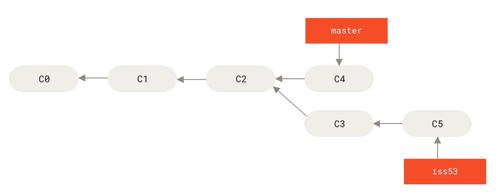
    * 
* 注
  * **合并完成后只有当前分支会移动，被合并分支不会**。
  * 合并完成后被合并分支就没啥用了，可以删除。

### 1.3.2 远程

##### 1.远程跟踪分支

* \<remote>/\<branch>
  * 常命名为--远程仓库名/分支名--的形式。

* 远程跟踪分支是远程仓库分支的一个引用。可以将其理解为远程仓库分支的别名。
* 名字是远程跟踪分支，实际是一个不可操作只能读的本地分支。
* git会为远程仓库的所有远程分支创建本地远程跟踪分支。
  * 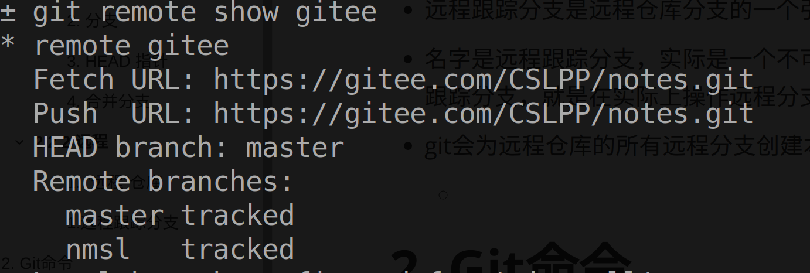
    * remote branches下面的是远程仓库的分支，后面tracked表示git已经在本地仓库创建了远程跟踪分支。
    * 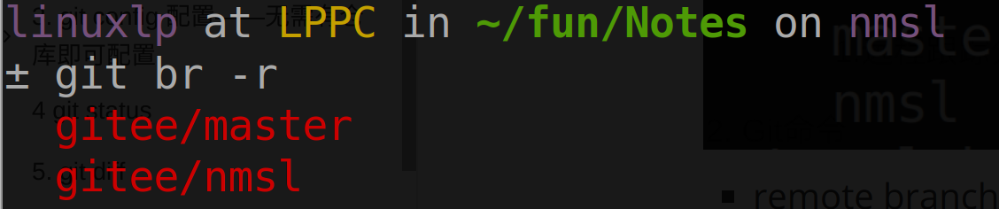
* 本地仓库存储的远程仓库的信息并不会实时更新，只有本地与远程通信时才会更新。所以每一次通信，git会自动移动远程跟踪分支以反映最新的远程分支状态。

##### 2. 跟踪分支

* 我们可以读远程跟踪分支得到最新的远程分支信息，那么我们如何快速得到一份可编辑的远程分支本地副本呢？答案是创建跟踪分支。**被跟踪的远程分支叫做“上游分支(upstream branch)”**。
  * 跟踪的作用就类似该本地分支绑定了跟踪的远程分支，git push，git pull不用指定参数，git自动往上游分支推送，自动从上游分支拉取。
* 创建跟踪分支
  * git clone  repo(假设默认分支是master)
    * 自动创建本地远程跟踪分支 origin/master ,创建本地跟踪分支master
    * master内容跟远程的master一样，可以直接编辑，然后push到远程。
  * [git branch testing]; git push -u origin testing
    * 创建本地分支testing，或者已有本地分支testing 
    * 在远程仓库创建同名分支testing，并跟踪该分支，如果想不同名git push -u origin testing:name
  * git checkout --tracked origin/testing
    * 在本地创建testing分支并跟踪远程分支testing。
* 上游快捷方式
  * 当设置好跟踪分支后，可以通过简写 @{upstream} 或 @{u} 来引用它的上游分支。 所以在
    master 分支时并且它正在跟踪 origin/master 时，如果愿意的话可以使用 git merge @
    {u} 来取代 git merge origin/master。

##### 3. git push 与 git pull

* push
  * 本质相当于把当前分支合并到远程分支。
    * 相当于跑到GitHub的服务器然后执行git fetch 本地； git merge 本地/branch
* pull
  * 本质相当于把远程分支合并到当前分支。
    * 相当于 ：git fetch 远程； git merge 远程/branch

# 2. Git命令

## 2.1 本地仓库

> 涉及的操作全是本地仓库操作

### 0. 创建仓库

* git init
  * 直接创建本地仓库
  * 默认创建master分支
* git clone [-o   name1]  URL  [name2]
  * 克隆远程仓库到本地
    * 创建本地常规分支master并跟踪远程仓库设定的默认分支。
  * URL指定远程仓库的地址
  * name1指定远程仓库在本地的名字
  * name2指定远程仓库在本地的副本的名字
    * 如果不指定name1,name2, 那么默认远程仓库名origin,默认本地仓库名同远程仓库名。

### 1. 通配符支持

* git的所有需要输入文件名的操作，都支持通配符操作。而且利用shell的通配符展开可以，git自己也可以解释通配符
  * git add *
    * git add参数是文件名，shell 展开*。
  * git add '*'
    * git add 参数是星号，git自己展开。

### 2. 帮助

> git help

##### 2.1 详细版

* git help verb
  * git help config
* git verb --help
  * git config --help
* man git-verb
  * man git-config

##### 2.2 简略版

* git verb
  * git config不加参数

### 3. 配置

> git config 配置——无需有仓库即可配置

#### 3.1三级配置文件(三级 scope)

* ##### system
  
  * --system
    * 与系统配置文件相关操作
  * 系统配置文件，适用于当前系统所有用户的所有仓库
  * 一般路径
    * git安装目录/etc/gitconfig(windows下)
    * /etc/gitconfig (Linux下)
  
* ##### global
  
  * --global
    * 与用户配置文件相关操作
  * 用户配置文件，适用于特定用户的所有仓库
  * 一般路径
    * $HOME/.gitconfig 或$HOME/.config/git/config
  
* ##### local
  
  * --local 或省略
    * 与仓库配置文件相关操作
  * 仓库配置文件，适用于特定仓库
  * 一般路径
    * .git/config
  
* ##### 快速找到所有配置文件位置

  * git config -l --show-scope --show-origin
  
* 注

  * 一般软件只有两级配置文件，一级系统级，常称为system, global，表示对该主机上所有用户生效，一级用户级，常称为user,表示对特定用户生效。
  * git 有三级，因为每个用户可以许多的仓库，因此最小的区分单元是仓库。
    * system 表示适用于该主机上所有用户的所有仓库
    * global表示适用于特定用户的所有仓库。(所以用了global)
    * local 表示适用于特定仓库

  * 同一般软件，这种分级配置文件，都是作用域小的配置文件覆盖作用域大的。

#### 3.2 配置增删改查

* ###### 注

  * git配置文件中每一项是一个键值对(key-value or name-value)对
  * --system，--global，--local(或省略)指定增删改查那个配置文件，**姑且称这三个参数为域参数**

##### 3.2.1 增

* ###### --add

  * git config --add  key value
    * git config --add user.name LP
    * git config --add --global user.name LP
  * 可以重复添加多个具有相同key的键值对
    * git config --add user.name LP
    * git config --add user.name LPP
    * git config --add user.name LPPP 
    * **这将在local域配置文件中增加三条user.name项，但是只有最后一条起作用**

* ###### 空

  * git config key value 
    * git config user.name LP
    * git config --global user.name LP
  * 不同于add，本质是如果没有该key那么新增一项，如果已经有了，则相当于修改该项的值。
    * 所以不支持增加重复key的键值对

* 注

  * 域参数要加在key前面
  * 如果要配置key对应的value为空，那么用''表示
    * git config core.pager ''

##### 3.2.2 删

* ###### --unset

  * git config --unset key
    * git config --unset --global user.name 
  * 删掉某个域配置文件中的指定key的键值对，如果该key匹配多个键值对，那么删除最后一个

* ###### --unset-all

  * git config --unset-all key
    * git config --unset-all user.name
  * 删除特定域配置文件中所有匹配该key的键值对，并不会删除所有配置文件中的匹配项，只会删除指定域配置文件中的所有匹配项

* 注意

  * 域参数要加在key前面

##### 3.2.3 改

* ###### --replace =--replace-all

  * git config --replace key  value
    * git config --replace --global user.name NB
  * 如果该域中有匹配键值对，那么修改，没有则新建。如果有多个匹配，那么只保留一个匹配，且修改为新值。
  * --replace-all 同--replace，因为如果有多个匹配，每个都修改全部保留，没啥意义，所以两个行为一样了，都是都删除，只留一个修改后的匹配。
  * 注
    * --replace 和空的区别
      * 基本行为都是没有对应key那么新建一项，如果只有一个对应key那么修改
      * 如果有多个对应key，则空无法处理，报错。--replace则删除所有对应项，然后只保留一个修改后的项。

* ###### -e,--edit

  * git config -e
    * git config -e --global
  * 用编辑器打开指定域配置文件，一次性满足增删查改要求。

##### 3.2.4 查

* ###### -l, --list

  * 查看所有配置项，三个文件里的所有内容
    
    * git config -l 
    * --system 仅查看系统配置文件
      * git config -l --system
      * --global
      * --local
  * --show-scope
    * git config --list --show-scope
      * 显示所有配置项，并显示配置项所属的配置级别
      * 老版本不支持该参数
  * --show-origin
    * git config --list --show-origin
      * 显示所有配置项，并显示配置项所属的配置文件
  * --show-scope --show-origin
    * git config -l --show-scope --show-origin
      * **快速找到git的配置文件所在位置**
    
  
* ###### --get,--get-all

  * git config **--get** key = git config key
    * git config --get user.name
    * 不加域参数显示当前git使用的key的值
      * 比如global域中配置了user.name ，local域中配置了user.name，那么显示local 的user.name。如果local中有多个user.name，那么显示最后一个。
      * 如果global中配置了user.name，local中没配置，那么显示global中的user.name
    * --system,--global, --local
      * 显示对应域中的匹配key值，如果有多个匹配，则显示最后一个。
  * git config **--get-all** key
    * git config --get-all user.name
    * 不加域参数，显示所有域中的匹配该key的值
    * --system，--global，--local
      * 显示对应域中的匹配key值，如果有多个匹配，显示所有。
  * --show-origin, --show-scope
    * git config --get --show-origin user.name
    * git config --get-all show-scope user.name

#### 3.3 常用配置项(大小写不敏感)

##### 3.3.1 user

* user.name
  * 提交的时候的名字
* user.email
  * 提交的时候的邮箱地址

##### 3.3.2 core

* core.quotepath
  * 值
    * true
    * false
  * git status输出的内容的显示编码
    * 为true，那么只能显示ASCII码，大于0x7F的都显示为转义字符形式
    * 为false，那么就可以正常显示UTF-8或者ANSI等编码字符了
* core.editor
  * 指定git调用的编辑器
  * 默认是vim，或者系统自带的啥啥啥
* core.pager
  * 指定git config --list 和git log 的输出形式，Linux下默认是less,如果要改为直接输出到屏幕
    * git config core.pager ''


##### 3.3.3 alias 别名

* 自定义git子命令的别名
  * git config --add --global alias.ci commit
    * 配置完之后  git ci == git commit
  * git config --add --global alias.st status
* 自定义外部命令的别名
  * git config --global alias.ls '!ls'
    * 配置完之后  git  ls == ls   当然纯属脱裤子放屁


##### 3.3.4 init

* init.defaultBranch
  * 本地新建仓库时创建的默认分支名，默认是master，如果想改，增加这个配置项就可以了。

##### 3.3.5 credential

> credential [krəˈdenʃl]   凭证

* credential.helper
  * 值
    * cache
      * 将凭证存储在内存中
    * store
      * 将凭证存储在硬盘中，Linux默认位置~/.git-credentials
    * 外部程序
  * 释义
    * 我们添加远程仓库是，有两种协议
      * https协议，利用账户名密码认证身份。**这个账户名密码就叫做凭证。**
      * 一种git协议，利用SSH协议公私钥机制认证身份。
    * 如果利用SSH协议，那么只需在本地生成公私钥，然后将公钥配置在GitHub上就行了，这样每次push或者pull就无须输入账户名密码。
    * 如果利用https协议，那么每次push，pull都要输入用户名密码，十分繁琐。
      * credential.helper就是用来解决这个问题的，顾名思义，凭证帮助，就是帮助我们管理凭证，也就是账户名密码。
      * 首先是自带的cache和store,这两个是git自带的凭证管理工具，前者将我们凭证存在内存，意味着我们输一次凭证后，短时间内就不用再重复输入了，后者将凭证存到硬盘，Linux是~/.git-credentials位置，输入一次凭证之后，本机以后再也不用重复输入了。
      * 除了自带的凭证管理工具，默认不设置helper情况下，git会利用系统自带的凭证管理工具，比如在windows下就会弹出Windows凭证管理器，提示保存凭证之后就不用重复输入凭证了。也可以手动指定helper为其他想用的外部凭证管理器。

##### 3.3.6 merge

* merge.conflictstyle

  > 默认状态下，和合并冲突时，git将冲突文件冲突部分修改成下面这样，方便我们处理冲突后提交
  >
  > 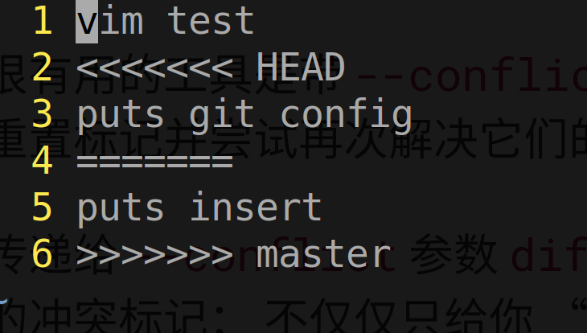

  * 值
    * merge
      * 当合并冲突时，git会修改冲突文件为以下形式
        * 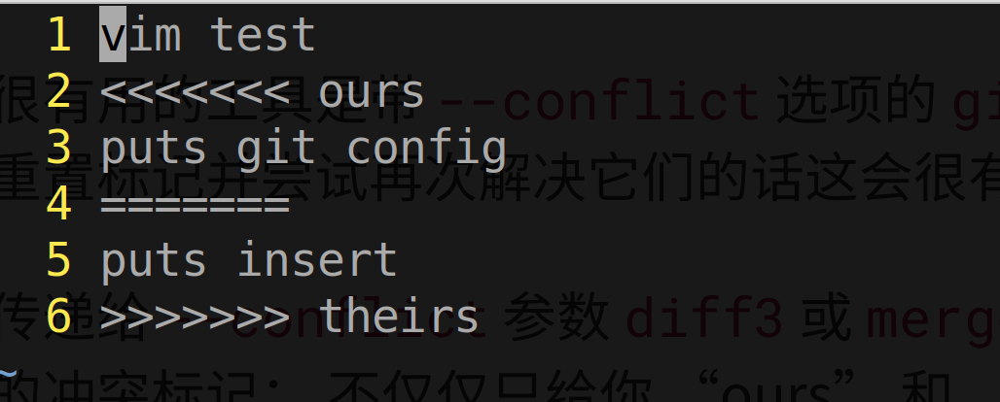
    * diff3
      * 当合并冲突时，git会修改冲突文件为以下形式
        * 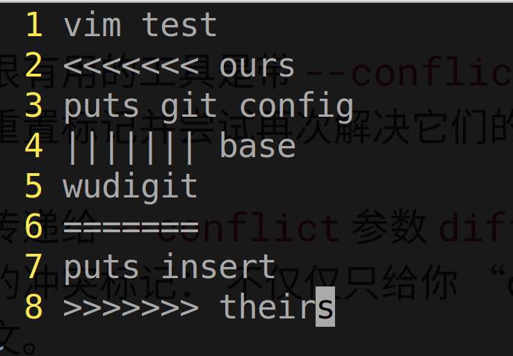

#### 3.4 配置.gitignore

> 详见 git help gitignore
>
> 在最简单的情况下，一个仓库可能只根目录下有一个 .gitignore 文件，它递归地应用到整
> 个仓库中。 
>
> 然而，子目录下也可以有额外的 .gitignore 文件。子目录中的 .gitignore
> 文件中的规则只作用于它所在的目录中。

* .gitignore中指示的文件会被git自动忽略，不跟踪也不会显示在未跟踪列表中。
* 常用格式
  *  所有空行或者以 # 开头的行都会被 Git 忽略。
  *  可以使用标准的 glob 模式匹配，它会递归地应用在整个工作区中。
  *  匹配模式可以以（/）开头防止递归。
  *  匹配模式可以以（/）结尾指定目录。
  *  要忽略指定模式以外的文件或目录，可以在模式前加上叹号（!）取反。

### 4. 查看本地仓库信息

##### 4.1 查看所有文件状态

>  git status

* git status
  * 查看文件状态
* git status -s
  * 查看文件状态简略形式

##### 4.2查看文件已修改、已暂存内容

> git diff

* git diff
  * 列出尚未暂存的修改
* git diff  --staged
  * 列出已暂存但未提交的修改
* git diff --check
  * 检查修改中的空白(应该尽量避免无意义的空白)

##### 4.3 查看历史提交信息

* git log

  * 按照时间顺序显示所有项目历史提交记录

  * 决定每条记录输出格式的参数

    * | Option                          | Description                                                  |
      | ------------------------------- | ------------------------------------------------------------ |
      | -p, --patch                     | 显示每条记录的修改内容                                       |
      | --stat                          | 简略显示每条记录的修改内容                                   |
      | --graph                         | 简单图形化显示分支，合并历史。配合--all --oneline参数效果更佳 |
      | --abbrev-commit                 | 仅显示 SHA-1 校验和所有 40 个字符中的前几个字符。            |
      | --oneline                       | --pretty=oneline --abbrev-commit 合用的简写。                |
      | --pretty=oneline                | 每条记录只用一行显示                                                                                --pretty是选项，这个选项可以使用不同于默认格式的方式展示提交历史。等号后面的是pretty自带的子选项。 |
      | --pretty=short                  | short,full,fuller子选项提供详尽程度不同的提交记录显示        |
      | --pretty=format:"<u>string</u>" | format ，可以定制记录的显示格式。这样的输出对后期提取分析格外有用——因为你知道输出的格式不会随着 Git 的更新而发生改变 |

  * 决定输出那些记录的参数

    * | 选项                       | 说明                                                         |
      | :------------------------- | :----------------------------------------------------------- |
      | -n                         | 仅显示最近的 n 条提交。                                      |
      | --all                      | 显示所有提交历史。不加--all情况下不显示其他分支的分叉提交，不显示当前分支所指提交对象的直接后继提交对象,不显示远程仓库的提交。 |
      | --since, --after="string"  | 仅显示指定时间之后的提交。字符串指定时间                     |
      | --until, --before="string" | 仅显示指定时间之前的提交。                                   |
      | --author="string"          | 仅显示作者匹配指定字符串的提交。字符串指定作者               |
      | --committer="string"       | 仅显示提交者匹配指定字符串的提交。                           |
      | --grep="string"            | 仅显示**提交说明**中包含指定字符串的提交。                   |
      | -S "string"                | 仅显示添加或删除的内容中匹配指定字符串的提交。                                          (常用于快速查看是谁修改了某个函数),这个不加等号。 |
      | --no-merges                | 不显示合并提交                                               |
      | 文件名或目录名             | 加在git log整条命令的**最后面**，表示只查看与该文件或目录有关的提交。git log -2 -p   README.md |

  * pretty子选项format详解

    * 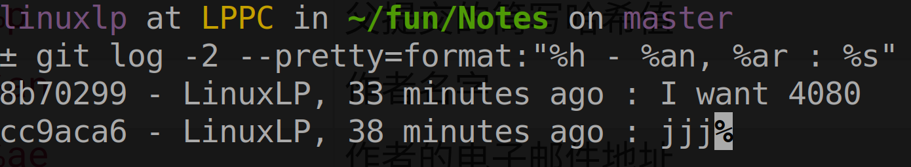

    * 占位符含义

      * | 选项  | 说明                                          |
        | :---- | :-------------------------------------------- |
        | `%H`  | 提交的完整哈希值                              |
        | `%h`  | 提交的简写哈希值                              |
        | `%T`  | 树的完整哈希值                                |
        | `%t`  | 树的简写哈希值                                |
        | `%P`  | 父提交的完整哈希值                            |
        | `%p`  | 父提交的简写哈希值                            |
        | `%an` | 作者名字                                      |
        | `%ae` | 作者的电子邮件地址                            |
        | `%ad` | 作者修订日期（可以用 --date=选项 来定制格式） |
        | `%ar` | 作者修订日期，按多久以前的方式显示            |
        | `%cn` | 提交者的名字                                  |
        | `%ce` | 提交者的电子邮件地址                          |
        | `%cd` | 提交日期                                      |
        | `%cr` | 提交日期（距今多长时间）                      |
        | `%s`  | 提交说明                                      |

### 5. 改变文件状态

##### 5.1 跟踪相关

* 跟踪文件
  * git add file...
* 取消跟踪
  * git rm <u>file1</u>...
    * 取消对文件的追踪并从工作目录删除文件。
      * 等价于 rm file1 ； git add file1
    * gir rm -f 
      * 如果要untrack的文件已经修改过或已暂存到暂存区域，需要-f强制。为了防止误删尚未保存到快照的数据。
  * git rm --cached <u>file</u>...
    * 取消对文件的追踪但是不从工作目录中删除

##### 5.2 修改相关

* git restore file...
  * 丢弃未暂存的修改

##### 5.3 暂存相关

* 暂存文件
  * git add file...
    * 跟跟踪是同一个命令，因为git add的本质是将文件变为预提交状态
* 取消暂存文件
  * git restore --staged file...

##### 5.4 重命名

* git mv  file1 file2
  * 重命名文件
  * 等价于:
    * mv file1 file2	
    * git add file1 file2

##### 5.4 提交

* git commit

  * git commit

    * 提交所有暂存区内容
    * 每一次提交就是git做一次快照(可以理解为复制一份所有文件)
    * 打开编辑器，输入提交说明

  * git commit -m "string"

    * 不打开编辑器，直接写说明

  * git commit -a

    * 等价于  git add * ; git commit
      * 即暂存所有修改，然后提交，相当于跳过手动暂存阶段。

  * git commit --amend

    * 将这次提交和上次提交合并为一个新的提交。
    * amend [əˈmend]  修正，修订
    * git commit --amend --no-edit
      * 如果只是想修改上次提交的提交内容，而提交信息不变，还用上次的，那么用这条命令

  * 良好的提交信息习惯

    > 一般情况下，信息应当以少于 50 个字符（25个汉字）的单行开始且简要地描述变更，接着是一个空白行，再接着是一个更详细的解释。模板如下：
    >
    > 首字母大写的摘要（不多于 50 个字符）
    > 如果必要的话，加入更详细的解释文字。在大概 72 个字符的时候换行。
    > 在某些情形下，第一行被当作一封电子邮件的标题，剩下的文本作为正文。
    > 分隔摘要与正文的空行是必须的（除非你完全省略正文），
    > 如果你将两者混在一起，那么类似变基等工具无法正常工作。
    > 使用指令式的语气来编写提交信息：使用“Fix bug”而非“Fixed bug”或“Fixes bug”。
    > 此约定与 git merge 和 git revert 命令生成提交说明相同。
    > 空行接着更进一步的段落。
    >
    > - 标号也是可以的。
    > - 项目符号可以使用典型的连字符或星号，后跟一个空格，行之间用空行隔开，
    >   但是可以依据不同的惯例有所不同。
    > - 使用悬挂式缩进
    >

### 6. 标签

> 所谓标签就是给某次提交打上标签，以示重要

##### 6.1 轻量标签、附注标签

* 轻量标签(lightweight)
  * 轻量标签是某次提交的一个引用，可以将其理解为这次提交的一个别名，提交的本名是校验码。
  * 所以轻量标签没有任何额外信息，git的实现方式就是维护一个文件，其中记录了标签名和其对应的提交。
* 附注标签(annotated)
  * 附注标签是一个单独的数据对象，存储了其对应的提交校验码，打标签的人，电子邮件，日期。以及一段标签信息。

##### 6.2 打标签

* git tag  name
  * 给最新的提交打一个轻量标签。
  * 一个提交可以打许多轻量标签
* git tag -a name -m 'info'
  * 给最新的提交打一个附注标签
  * -m之后参数指定附注标签内容，如果不指定，那么也会打开编辑器让你写一个。
  * 一个提交可以打许多附注标签
* 任意历史提交打标签
  * 在打标签命令最后加上提交的40位校验码或者7位短校验码，即可给该提交打标签

##### 6.3 查看标签

* git tag
  * 字母顺序列出所有标签
* git tag `-l`  pattern
  * 列出匹配pattern的所有标签，支持glob通配符
* git show  \<tagname\>
  * 如果标签是轻量标签，列出对应提交信息
  * 附注标签，列出标签本身信息加对应提交信息。

##### 6.4 删除标签

* git tag -d \<tagname>
  * 删除本地标签
* git push \<remote\> --delete \<tagname\>
  * 删除远程仓库标签

##### 6.5 共享标签

> 默认的push不会推送标签，但是pull和fetch会拉取标签。。。

* git push \<remote> \<tagname>
  * 将标签push到远程仓库
  * 因为默认push不会推送标签
* git push \<remote> --tags
  * 将所有本地标签推送到远程仓库

### 7. 本地分支

> 所谓分支，本质上是某个提交对象的引用，即提交对象不同的名字罢了。

#### 7.0 分类

##### 7.0.1 本地常规分支

* 本地新建的分支
* 支持查看、新建、检入检出、删除、移动、合并、被合并、推送、拉取
  * 查看指查看分支名，查看所指索引对象
  * 检入指checkout切换到分支，检出指切换出去。
  * 移动指指向其他的提交对象
  * 合并指合并其他本地分支，本质是合并后移动到新的提交对象
  * 被合并指被其他本地常规分支合并，当前分支不会移动。
  * 推送指将此分支推送到远程仓库的某个分支
  * 拉取指将远程仓库的某分支拉取到此分支

##### 7.0.2 本地远程跟踪分支

> Git 将这些远程引用作为记录远程服务器上各分支最后已知位置状态的书签来管
> 理。(远程引用就是指本地远程跟踪分支)

* git基于本地存储的远程仓库信息自动创建的远程分支的引用

* 支持查看、被合并
  * 即支持只读操作
  
* 不支持新建、检入检出、删除、移动、合并、推送、拉取
  * 即不支持写操作
  
* 作用
  * 除了在远程仓库服务器上亲手操作(或者在github网页上)，我们无法实时操作远程分支。
  
  * git在本地提供了名为\<remote>/\<branch>远程跟踪分支，可以理解为远程分支的引用或者说别名。也就是他的信息和远程对应分支的信息是一模一样的。某种意义上，虽然它是本地分支，但是它代表了远程分支。
  
  * 它的信息来自于本地存储的远程仓库的信息，每当与远程仓库通信时(push,pull,clone, fetch),该信息会同步。这就意味着此时本地存储的远程仓库信息是上一次通信后的信息，并不是最新的信息
  
  * 默认引用规范下git会自动为所有远程分支在本地创建远程跟踪分支
  
    * 引用规范(refspec   reference  specification)形如下面
  
      * ```shell
        [remote "gitee"]
        	url = https://gitee.com/CSLPP/Linux.git
        	fetch = +refs/heads/*:refs/remotes/gitee/*
        #fetch这条表示引用规范， refs/head/* 所有分支引用
        # refs/remotes/gitee/* 表示本地存储的有关gitee这个仓库的所有本地远程跟踪分支
        # 这条由git remote add 执行时自动创建，就是默认的引用规范
        # 意思就是为远程仓库的每一个分支在本地创建对应的远程跟踪分支
        ```
  
  * 远程跟踪分支完全就是只读的本地分支。

##### 7.0.3 本地常规跟踪分支

* 跟踪远程分支的本地常规分支
* 支持查看、新建、检入检出、删除、移动、合并、被合并、推送、拉取、跟踪、取消跟踪
  * 因为是一种特殊的本地常规分支，所以支持普通本地常规分支的一切操作
  * 同时因为其特殊属性，支持了跟踪相关的操作。
* 作用
  * 因为不能直接通过本地远程跟踪分支操作远程分支，所以git提供pull，push机制操作远程分支。
  * pull， push机制是针对分支级别操作的，所以每次pull，push都需要指定从本地哪个分支push到哪个远程仓库的哪个分支，从哪个远程仓库的哪个分支pull到本地的哪个分支。
  * 本地常规跟踪分支跟踪的那个远程分支一般称为其上游分支。
  * 所以为了省事儿，一旦本地常规分支跟踪了某个远程分支，那么在这个分支push或pull无需指定远程信息，git自动将其设为跟踪了的那个分支。

##### 7.0.4 术语

* 以下声明"本地常规分支"或"分支"的，表示只能用于本地常规分支(包括本地常规跟踪分支)
* 以下声明"本地远程跟踪分支"的，表示只能用于本地远程跟踪分支
* 以下声明"本地跟踪分支"的，表示只能用于本地跟踪分支
* **以下声明"本地分支"的，表示可以用于本地常规分支和本地远程跟踪分支**
* 以下声明"当前分支"的，是"当前本地常规分支"的简写，因为本地远程跟踪分支不能检入检出

#### 7.1 查看分支

* git branch
  * 查看所有本地常规分支
* git branch -r
  * 查看所有本地远程跟踪分支。
    * 该命令只是列出了上次通信后的所有远程分支对应的远程跟踪分支，上次通信后新创建的远程分支对应的这里就显示不了了。不过可以  git fetch --all ; git branch -r 就行了。
* git  branch -v
  * 查看所有本地常规分支的最后一次提交
* git branch  -vv
  * 查看所有本地常规分支的最后一次提交，如果有本地常规跟踪分支，列出它们的上游分支。
* git branch --merged \<branchname>
* git branch --no-merged \<branchnamg>
  * 列出已经合并到或者没合并到该**本地分支**的本地常规分支。
  * 省略分支名，列出已经合并到或者没合并到当前分支的分支。
  * 不管是三方合并还是快速合并，合并后的结果一定是被合并分支所指的提交对象是当前分支所指提交对象本身或者其祖宗对象。
    * 所以借此来列出已经合并到当前分支的分支，它们所指的提交对象是当前分支所指提交对象或者其祖宗。
    * 没有合并到当前分支的分支，它们所指的提交对象要么在分叉上，要么是当前分支所指对象的后代。

#### 7.2 创建分支

* git branch \<name>
  * 创建一个本地常规分支。
    * 本质是创建一个指向当前分支指向的提交对象的可移动指针
* git branch \<newBranchName> \<existedBranchName>
  * 创建一个指向某个存在的本地分支指向的提交对象的分支
  * 也可以说基于existedBranchName创建一个新分支
* git checkout  -b \<name>
  * 基于当前分支创建一个新分支并切换到该新分支
  * git checkout -b testing == git branch  testing ; git checkout testing
* git checkout -b  \<branchName\> \<existedBranchName>
  * 基于给定分支创建一个新分支并切换到该分支
* git checkout -b \<branchName>  \<remote>/\<branch>
  * 创建一个跟踪该远程分支的本地跟踪分支并切换到该分支
* git checkout  --track \<remote>/\<branch>
  * 创建一个跟踪该远程分支的同名本地跟踪分支并切换到该分支
* git pull  \<remote\>    remoteBranch:localBranch
* git pull \<remote>    branch   <==>  git pull \<remote>  branch:branch
  * 将远程分支拉取到本地常规分支，如果**本地常规分支不存在，那么创建并拉取**


#### 7.3 删除分支

* git branch -d \<branchName>
  * 删除该分支
  * 如果该分支没有被合并到任何分支，那么git拒绝删除,要想强制删除，使用-D。

#### 7.4 跟踪远程分支

* git branch  [existedBranchname] -u  \<remote\>/\<branch\>
  * 设置已存在分支跟踪某个远程分支
    * 省略本地常规分支名，默认为当前分支
    * 本地常规分支没有上游分支，那么跟踪该远程分支
    * 本地常规分支有上游分支，那么改为跟踪该远程分支
* git branch [existedBranchName]  --unset-upstream
  * 取消已存在分支的跟踪状态
    * 省略本地常规分支名，默认为当前分支
* git push -u \<remote> localBranch:remoteBranch
* git push -u \<remote> branch
  * 推送的同时设置此本地常规分支跟踪对应远程分支
* git pull --set-upstream \<remote> localBranch:remoteBranch
* git pull --set-upstream \<remote> branch
  * 拉取的同时设置此本地常规分支跟踪对应远程分支

#### 7.5 检入检出分支

##### 7.5.0 注意点

* 检入检出

  * 所谓检入，检出分支就是切换当前分支

* 工作目录变化

  * 注意切换分支时当前工作目录会发生变化**，**当前工作目录的内容是当前分支所指向的可提交对象保存的快照内容。
  * 所以切换到新分支之后，工作目录变为新分支指向的可提交对象保存的快照内容。

* 干净(clean)状态

  * 想要切换到别的分支，当前分支必须是干净状态(clean)。

    * 所谓干净状态就是没有已修改但没暂存的文件或已暂存但没提交的文件，相当于 git add . && git ci  之后的状态。

    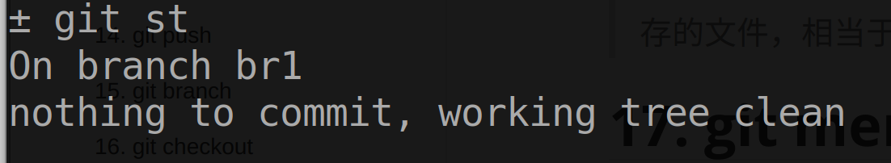

##### 7.5.1 干净状态下切换

* git checkout \<branchname>
  * 切换到指定分支
  * 如果本地不存在名为branchname的分支，而存在名为branchname的远程分支，那么创建同名本地常规分支并跟踪该远程分支。

##### 7.5.1 非干净状态处理

> stash 	[stæʃ]  存放，贮藏

* git stash push
  * 将当前工作状态存到git提供的贮存栈上
    * 如果工作干到一半需要切换到另一分支但是并不想提交，那么git stash push将工作状态保存到git栈上，现在就是干净状态了。
* git stash apply --index
  * 切回分支，应用该命令，就可以还原切出去那时的工作状态。

#### 7.6 合并分支

##### 7.6.1 合并

* git merge \<branchName>
  * 将**本地分支**合并到当前本地常规分支
    * branchName分支不移动，**真正移动的是当前分支。**
  * 如果有冲突，需要手动处理冲突之后再提交才能合并。

##### 7.6.2 合并冲突

> fix conflicts

###### 1. 原因

* 一般是不同分支修改了同一文件的同一部分导致冲突

###### 2. 查看

* 手工打开冲突文件查看

  * ```
    <<<<<<< HEAD
    lp
    ||||||| de515b8
    hello
    =======
    world
    >>>>>>> master
    ```

  * 第2行表示当前分支做的修改

  * 第4行表示两个分支没修改之前的样子

  * 第6行表示master分支做的修改

* git diff

  * git diff --ours
    * 显示我们的修改(当前分支的修改)
  * git diff --theirs
    * 显示它们的修改(要合并的分支)
  * git diff --base
    * 显示我们，它们修改的同一部分原来的样子。
  * eg
    * 文件第一行如下: hello world
      * 分支master 修改为hello China
      * 分支main 修改为 hello  earth
    * 在master分支执行 git merge main
      * git diff --ours 显示 hello China
      * git diff --theirs 显示 hello earch
      * git diff --base 显示 hello world

###### 3. 处理

* 手动处理
  * 手动打开冲突文件，修改冲突部分。
  
* 命令处理
  * git merge --abort
    * 撤销这次合并，回到合并前状态
  * git checkout --conflict=diff3  conflictFile
    * 将当前冲突文件修改为这种形式。(不理解的话参考本笔记配置部分的merge部分)
      * 
  * git checkout --ours file
    * 修改冲突文件，保留我们的修改，丢掉它们(theirs)的修改。(这样就不用我们手动编辑冲突文件了)
  * git checkout --theirs file
    * 修改冲突文件，保留它们的修改，丢掉我们(ours)的修改


#### 7.7 移动分支

> 合并分支时git会自动移动分支，我们不讨论这个
>
> 我们讨论通过git reset 命令手动移动分支。
>
> 手动移动分支就实现了切换到任意一个提交对象的目的，即实现了回到任何一个历史版本的目的。
>
> 终于知道如何回到任意一个状态了。所谓的状态也就是所有文件的某个快照，也就是某次提交。git reset可以让当前分支回到任意一个提交处，没错，任意提交，这些提交可以是别的分支的提交，总之是该仓库的任意提交。
>
> 当前分支默认状态下指向该分支最新的一个提交，通过git reset 可以移动当前分支，使其指向任意一个提交。为了方便，加下来称当前分支此时指向的提交为源提交，接下来将要移动到的提交称为目的提交。

* 差异

  * 每当使用git reset时，git会自动计算源提交和目的提交之间的差异，并且这个计算方式是:

    > 源提交 -  目的提交 = 差异。

    * 也就是说目的提交加上显示的差异就能还原回源提交。

  * git提供不同的方式让我们处理这些差异。

* git reset --soft  SHA-1

  * 将当前分支指向SHA-1序列码代表的提交。即，回到这次提交的文件快照状态。
  * --soft表示，显示差异，并且差异为已暂存状态。

* git reset [--mixed] SHA-1

  * 同理回到特定提交
  * --mixed或者或省略， 显示差异，并且差异为已修改未暂存状态。

* git reset --hard SHA-1

  * 回到特定提交
  * --hard,丢弃差异，相当于完全回到当时提交的状态，一模一样复现当时的情景。

* 作用

  * 回到特定文件版本
    * 新建一个move分支，然后可以随意移动move分支到任意提交处，舒服的一比。
  * 压缩提交
    * 可以移动当前分支到10个提交之前，利用--soft参数，会暂存目的提交和最新提交的差异，也就是这10个提交所做的修改，然后直接提交，相当于用这一个提交代替了10个提交。

#### 7.8 推送拉取分支

##### 7.8.1 释义

* 通信

  * git提供push，pull机制来进行本地和远程仓库之间的通信，以实现互相同步

    * push类似本地修改，然后将其同步到远程

    * pull类似远程修改，然后将其同步到本地
* **分支对分支**
* push, pull是分支对分支的，需要指明哪个分支要推送、拉取哪个分支
* 本质

  * push，pull的本质其实是一种“合并”
    * push将本地常规分支推送上去，然后git自动将其合并到对应远程分支。
      * 这种只能处理简单的快速合并，即本地分支指向的提交对象是远程分支指向对象的后代。(称为本地分支比远程分支新),这样只需简单将远程分支指向本地常规分支所指的那个就行了
      * 如果出现分叉或者远程分支更新，那么git不会自动合并，会提示存在分歧(divergent)，那么我们需要先fetch远程信息，然后手动合并，之后在push。
        * 这里用词是分歧而不是冲突(conflict)的原因是只要有分叉或者远程分支更新，git就拒绝push，而不会尝试自动合并。而冲突则是自动合并失败的原因。
    * pull将远程分支拉取下来并自动将其合并到对应本地分支。
      * 就类似git fetch + git merge(或git rebase) 的组合，git拉去后自动合并
      * 同样只能简单快速合并，如果出现分叉或本地分支更新情况，即分歧(divergent),需要手动合并。
  * 换位思考
    * push
      * 本地执行push，相当于远端执行git pull(git fetch + git merge)
    * pull
      * 本地执行pull，相当于远端执行git push
    * git
      * 这一切都是git自动完成的，强。

##### 7.8.1 push

> git push本质是写远程仓库，所以你得有远程仓库的写权限才能push

* git push \<remote\>    localBranch:remoteBranch
  * 释义
    * 将本地某个分支推送到远程仓库某个分支，如果远程分支不存在，那么创建并推送。
      * remote指定远程仓库名
      * remoteBranch指定该远程仓库的一个远程分支名
      * localBranch指定要推送那个本地常规分支，可以用具体的分支名字，也可以用HEAD，表示当前分支。
  * 变体
    * git push \<remote>    branch   <==>  git push \<remote>  branch:branch
      * 简写，表示将本地常规分支推送到**同名**远程分支
    * git push -u \<remote> localBranch:remoteBranch
    * git push -u \<remote> branch
      * -u表示推送的同时设置此本地常规分支跟踪对应远程分支。
    * git push
      * 简写，如果当前分支已经跟踪了一个同名远程分支，那么直接执行git push就行。

##### 7.8.2 pull

> git push本质是读远程仓库，所以你得有远程仓库的读权限才能push

* git pull  \<remote\>    remoteBranch:localBranch
  * 释义
    * 将远程分支拉取到本地常规分支，如果本地常规分支不存在，那么创建并拉取
      * remote指定远程仓库名
      * remoteBranch指定该远程仓库的一个远程分支名
      * localBranch指定要拉取到哪个本地常规分支，可以用具体的分支名字，也可以用HEAD，表示当前分支。
  * 变体
    * git pull \<remote>    branch   <==>  git pull \<remote>  branch:branch
      * 简写，表示将远程分支拉取到**同名**本地常规分支
    * git pull --set-upstream \<remote> localBranch:remoteBranch
    * git pull --set-upstream \<remote> branch
      * --set-upstream 表示拉取的同时设置此本地常规分支跟踪对应远程分支。
    * git push
      * 简写，如果当前分支已经跟踪了一个远程分支，那么直接执行git pull就行。
        * 相比git push，不需要同名

## 2. 2 远程仓库

> 主要涉及本地与远程仓库的交互操作

### 1. 创建仓库

##### 1.1 远端

* 去github机房手动操作git服务器新建仓库
* GitHub网站新建仓库

##### 1.2 本地

### 2. 本地管理远程仓库

> git提供了在本地存储远程仓库信息的功能，借助这个功能，我们就可以离线工作了。
>
> 好处是离线也能知道远程仓库的信息，坏处就是切记这个信息是上一次通信后远程仓库的信息，而不是最新的。

* git remote
  * 列出本地存储的所有的远程仓库
* git remote -v
  * 显示需要读写远程仓库使用的 Git 保存的简写与其对应的 URL
* git remote show \<remote\>
  * 显示远程仓库的详细信息
    * 包括远程仓库分支有多少个，本地是否已经生成了对应的远程跟踪分支
    * git push中那些本地分支跟踪了远程分支
    * git pull中那些本地分支跟踪了远程分支
* git remote add \<name\> \<url\>
  * 添加远程仓库，name是本地远程仓库的名字，用来代替次次输入远程仓库的URL。
* git remote rename \<oldname> \<newname>
  * 修改远程仓库的名字
* git remote rm \<remote>
  * 移除远程仓库

* git fetch \<remote\>
  * 拉取远程仓库的信息并按需创建删除本地远程跟踪分支
    * 相当于更新本地存储的远程仓库的信息。
* git fetch --all
  * 拉取所有远程仓库的信息

### 3. 远程分支

#### 3.3 创建分支

##### 3.3.1 远端

* 去github机房手动操作git服务器新建分支
* GitHub网站新建分支

##### 3.3.2 本地

* git push \<remote\>    localBranch:remoteBranch
* git push \<remote>    branch   <==>  git push \<remote>  branch:branch
  * 将本地某个分支推送到远程仓库某个分支，**如果远程分支不存在，那么创建**并推送。

#### 3.4 删除分支

##### 3.4.1 远端

* 去github机房手动操作git服务器删除分支
* GitHub网站删除分支

##### 3.4.2 本地

* git push \<remote>  --delete \<branch>
  * 删除远程仓库的分支
