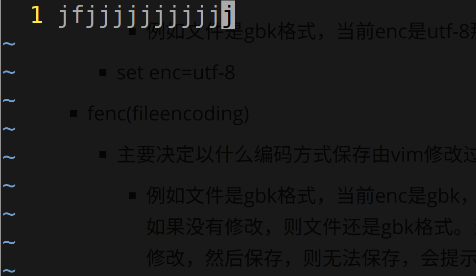
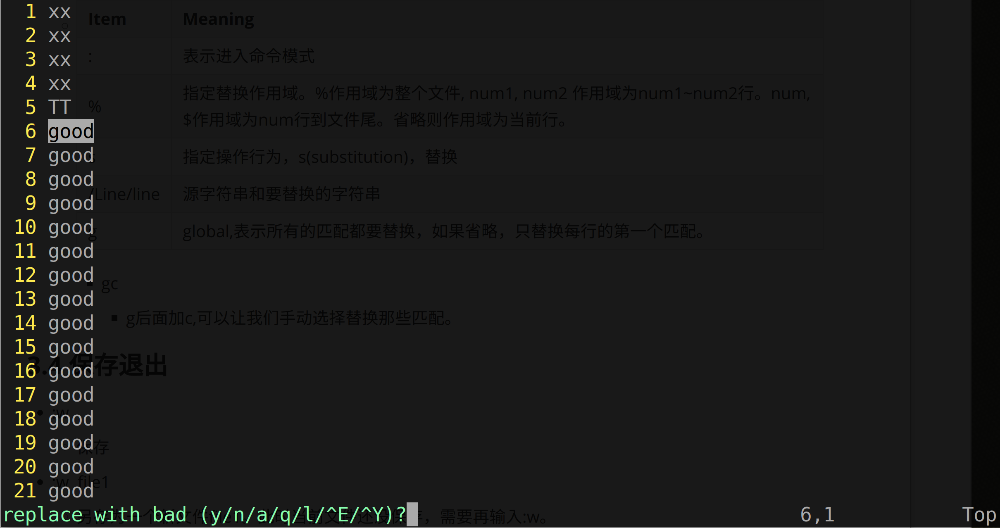

# 							VIM 永远滴神！

# 1.Vim配置

### 1.1 配置文件位置

* :version 命令
  * 系统级配置文件-----系统所有用户通用
    * $VIM/vimrc
  * 用户级配置文件-----当前用户使用，覆盖系统配置文件
    * $HOME/_vimrc  (Windows)
    * $HOME/.vimrc（Linux）
  * 默认配置文件(当没有系统配置文件和用户配置文件时使用这个)
    * $VIMRUNTIME\defaults.vim
  * $VIM
    * 一般是vim安装目录
    * 因为linux系统级配置文件一般存放在/etc/，所以$VIM/vimrc一般是个软链接文件，链接/etc/vim/vimrc。
  * $HOME
    * 家目录，Linux下是~(/home/xxx/)，windows下是C:\Users\XXX\
  * **查看$VIM等环境变量的方法**
    * :echo $VIM(在vim环境中输入，而不是在shell中)

### 1.2 重要的配置项

* 编码
  * vim编码相关的主要有三个参数
    * enc(encoding)
      * 主要决定以什么编码方式打开文件
        * 例如文件是gbk格式，当前enc是utf-8那么vim打开就是乱码，要设置enc为gbk
      * set enc=utf-8
    * fenc(fileencoding)
      * 主要决定以什么编码方式保存由vim修改过的文件
        * 例如文件是gbk格式，当前enc是gbk，fenc是utf-8，则修改之后保存文件为utf-8。但是如果没有修改，则文件还是gbk格式。当然如果enc是utf-8格式，打开之后是乱码，然后修改，然后保存，则无法保存，会提示无法转换编码。所以只有首先正确打开文件之后，及enc编码同文件编码，则修改后保存fenc才能起作用。
      * set fenc=utf-8
    * fencs(fileencodings)
      * vim的enc不是设置死的，可以猜测实际的文件编码，fencs就制定了**猜测的编码列表**。
        * 默认不设置enc情况下，enc同系统默认编码，我的windows下就是gbk。当无法打开时，vim可能会逐一将enc赋值为fencs中的编码，然后尝试打开。
      * set fencs=utf-8,gb2312,gbk,big5,gb180302
* 搜索
  * set incsearch
    * incremental search  递进搜索，普通的搜索状态时，输入一个完整的搜索项，然后enter，然后显示匹配。递进搜索从第一个字符输入开始就显示匹配，然后不断输入，不断显示最新匹配。
    * 例如输入i，那么显示i匹配的，之后输入n，那么显示in匹配的，然后输入c，显示inc匹配的。。。


### 1.3 我的Vim配置文件

```shell
set syntax=on 			"启用语法高亮
set number			"显示行号
set ignorecase			"搜索忽略大小写
"设置编码
set enc=utf-8
set fenc=utf-8
set fencs=utf-8,gb2312,gbk,big5,gb180302

set mouse=a			"设置可以使用鼠标

set hlsearch			"设置搜索高亮highlightsearch

```

# 2. Vim特性

* 
  * 波浪号(tilde characters)表示改行没有任何文本，包括whitespace
* 
  * Normal Mode
    * 主要用来移动光标，浏览内容
  * Insert Mode
    * 编辑
  * Visual Mode
    * 选中内容，类似鼠标点选文本。
  * Command Mode
    * 输入冒号后输入各种命令或者输入斜杠后搜索。

# 3. Vim技巧

### 3.1 移动光标

#### 3.1.1 普通移动

| Key        | Move                                       | Key           | Move                   |
| :--------- | :----------------------------------------- | ------------- | ---------------------- |
| h          | 左                                         | Ctrl f,  PgDn | 向下翻页               |
| j          | 下                                         | Ctrl b, PgUp  | 向上翻页               |
| k          | 上                                         | Ctrl d        | 向下翻半页             |
| l          | 右                                         | Ctrl u        | 向上翻半页             |
| 0          | 移到行首                                   | Ctrl e        | 向下翻一行             |
| ^          | 移到非空白字符行首                         | Ctrl y        | 向上翻一行             |
| $          | 移到行位                                   | zt            | 当前行翻到最上(top)    |
| w          | 移到下个单词首字母(标点符号视为独立单词)   | zz            | 当前行翻到居中         |
| W          | 移到下个单词首字母(标点符号视为单词一部分) | zb            | 当前行翻到最下(bottom) |
| b          | 移到上个单词首字母(标点符号视为独立单词)   |               |                        |
| B          | 移到上个单词首字母(标点符号视为单词一部分) |               |                        |
| %          | 当前字符是括号，移到对应括号处             |               |                        |
| numG,numgg | 数字加G或gg，移到指定行                    |               |                        |
| G          | 移到文件尾                                 |               |                        |
| gg         | 移到文件头                                 |               |                        |
| H          | 移到本页最上(High)                         |               |                        |
| M          | 移到本页居中(Middle)                       |               |                        |
| L          | 移到本页最下(Low)                          |               |                        |

#### 3.1.2 搜索移动

* 行搜索

  * f <u>char</u>
    * 从当前字符处向后搜索字符, 如果第一个不是想要的
    * **按分号重复搜索**，不要傻傻的再输一遍f char了。。。。
  * F <u>char</u>
    * 同f,只不过是向前搜索
  
* 文件搜索

  * /pattern + ENTER

    * 从当前字符所在位置往文件尾方向搜索(forward search)匹配字符串,如果搜索到文件尾，不会停止，会继续从文件头开始往下搜。(这种类似循环搜的特性叫search wrappipng)
      * 搜到结尾会提示 
      
    * n 下一个匹配， N 上一个匹配
    
    * 支持正则表达式，与POSIX不太一样，有自己的版本，下面列出，如果需要转义，那么会显式加上\\\.没加的表示不需要转义，转义可能适得其反，失去其特殊意义。
    
      * 
        | Characters  | Meaning                                                      |
        | ----------- | ------------------------------------------------------------ |
        | ^, $        | 锚点，前者指示行头，后者指示行尾                             |
        | \\<,\\>     | 锚点，前者指示单词开头，后者指示单词结尾。for 匹配 aforb, forc, \\<for只匹配forc。 |
        | .           | 点匹配任意一个字符                                           |
        | \a          | 匹配任意一个字母字符(a-zA-Z)                                 |
        | \\u         | 匹配任意一个大写字母                                         |
        | \d          | 匹配任意一个数字字符                                         |
        | [abc]       | 匹配给定字符集合中的任意一个                                 |
        | [a-z],[A-Z] | 支持短横线表示范围，支持POSIX的[[:upper:]]等预定义字符集合   |
        | [^abc]      | 匹配不在给定字符集中的其他任意一个字符                       |
        | *           | 放在字符或字符集合后面，表示字符匹配0~无穷次                 |
        | \\+         | 放在字符或字符集合后面，表示字符匹配1~无穷次                 |
        | \\=         | 放在字符或字符集合后面，表示字符匹配0~1次                    |
        | \\{n}       | 放在字符或字符集合后面，表示字符匹配n次。(注意只有第一个花括号需要转义符，vim就能理解这是特殊意义) |
        | \\{n,m}     | 放在字符或字符集合后面，表示字符匹配n~m次                    |
        | \\{n,}      | 放在字符或字符集合后面，表示字符匹配n~无穷次                 |
        | \\{,m}      | 放在字符或字符集合后面，表示字符匹配0~m次                    |
        | \\(\\) | 成组(Grouping) 。\\(bcd\\)\\+ ,匹配bcd, bcdbcd, bcdbcdbcd ... 。成组后，可以用\\1,\\2...代表先前出现的组。A\\(bcd\\)B\1  匹配AbcdBbcd |
        
    
  * ？pattern + ENTER
    * 同/，唯一的区别是反向搜索(backward search)。
    
  * \*
  
    * 搜索匹配当前光标下的单词，完全匹配。如果想搜索包含该单词的，用g\*
  
  * 搜索历史
    * 跟shell一样，输入/之后，上下箭头或者Ctrl p/n切换历史，然后enter执行。

### 3.2 编辑

> 该表中说的所有删除，本质是剪切，vim会存储它们用于粘贴。

* 进入插入模式和快速编辑

  * | Key      | Meaning                                              |
    | -------- | ---------------------------------------------------- |
    | i        | 当前字符处输入                                       |
    | I(大写i) | 非空白行首输入                                       |
    | a        | 当前字符后输入                                       |
    | A        | 行尾输入                                             |
    | o        | 该行下面新启一行输入                                 |
    | O        | 该行上面新启一行输入                                 |
    | r        | 将当前字符替换为接下来输入的字符                     |
    | R        | 进入替换模式，替换为接下来输入的所有字符(仅限当前行) |

* 剪切，复制，粘贴

  * | Key             | Meaning                                                      |
    | --------------- | ------------------------------------------------------------ |
    | x               | 删除当前字符                                                 |
    | s               | 删除当前字符并进入插入模式                                   |
    | numx            | 删除num个字符(仅限当前行)                                    |
    | dd              | 删除当前行                                                   |
    | numdd           | 删除num行(从当前行开始)                                      |
    | dW              | 删除当前字符到下个单词首字母                                 |
    | dw, dB,db       | 同理，取决于w,B,b的不同语义                                  |
    | d$              | 删除当前字符到行尾                                           |
    | d^, d0          | 同理                                                         |
    | dG              | 删除当前行到文件尾, dgg同理                                  |
    | dnumG           | 删除当前行到第num行                                          |
    | diw             | 删除当前字符所在的单词                                       |
    | diW             | 同理，只不过w,W范围不同                                      |
    | di{,  di[, di ( | 删除大中小括号内所有内容。匹配最近的括号范围                 |
    | c               | c基本与d的功能一模一样，唯一的区别就是c删除后会进入插入模式。 |
    | y               | y的用法与d一模一样，区别在于d是删除范围内容，y是复制范围内容。 |
    | p               | 如果复制或剪切的是字符，将字符粘贴到当前字符后。如果复制或剪切的是行或块，将内容粘贴到当前行下。 |
    | P               | 同p，只不过是粘贴到字符前，行上                              |
    | J               | 把当前行下一行连接到当前行尾部(相当于剪切粘贴下一行到当前行行尾) |

* 缩进

  * | Key     | Meaning                                                      |
    | ------- | ------------------------------------------------------------ |
    | <<,>>   | 正常模式下，调整当前行缩进。num<<;前缀数字，可以同时调整num行。这个配点命令绝配，如果想连续调整4行，需要不断输入4>>,4>>,4>>，慢的一比，如果用点，直接 4>>, ., .无敌。。。   Vim称这种缩进(index)调整称为shift,>>一次，相当于往右shift一次。 |
    | <%,>%   | 光标放到{}上，{}本身和其包含的块整体左移4或者右移4个空格。   |
    | <i{,>i{ | 光标放到{}上，{}包含的块整体左移4或右移4个空格。(移一个空格取决于shiftwidth配置) |

* 魔法

  * | Key  | Meaning                                                      |
    | ---- | ------------------------------------------------------------ |
    | .    | 点命令，重复上一次编辑操作，太吊了。。举个例子，输入command，还想在别处输入，常规做法是yw复制command，然后p粘贴。用点，输完之后想在哪儿在输入就在哪儿按点就行了。 |
    |      |                                                              |
    |      |                                                              |

    

### 3.3 替换(substitution)

* :%s/Test/test/g

  * 将文件所有Test替换为test

  * | Item       | Meaning                                                      |
    | :--------- | :----------------------------------------------------------- |
    | :          | 表示进入命令模式                                             |
    | %          | 指定替换作用域。%作用域为整个文件, num1, num2 作用域为num1~num2行。num, $作用域为num行到文件尾。省略则作用域为当前行。 |
    | s          | 指定操作行为，s(substitution)，替换                          |
    | /Line/line | 源字符串和要替换的字符串                                     |
    | g          | global,表示所有的匹配都要替换，如果省略，只替换每行的第一个匹配。 |

    * gc

      * g后面加c,可以让我们手动选择替换那些匹配。

      * 

        * 每一个匹配都让我们手工选择是否替换

          * | key      | Meaning                                                  |
            | -------- | -------------------------------------------------------- |
            | y        | yes，替换当前匹配                                        |
            | n        | no,   不替换当前匹配                                     |
            | a        | all, 替换所有匹配                                        |
            | q        | 不替换当前匹配且直接退出(意味着之后的所有匹配也不替换了) |
            | l        | 替换当前匹配且退出                                       |
            | ctrl e,y | 没啥用，有点脑残的设计                                   |

* :%/pattern/string/g

  * 搜索支持正则表达式，详见vim搜索部分。


### 3.4 保存退出

* :w
  * 保存
* :w  file1
  * 另存为一个新文件file1。此时当前文件还没保存，需要再输入:w。
* :q(:q!)
  * 退出，如果有未保存的更改,需要先保存在退出。如果丢弃更改，q!强行退出。

### 3.5 多文件编辑

##### 3.5.1 打开多个文件

* vim file1  file2 file3
  * 一次性打开所有要编辑的文件
* :e file1
  * 已经打开文件的前提下，打开另外的文件。

##### 3.5.2 文件之间切换

* :buffers
  * 输出当前打开的所有文件和编号
* :buffer num
  * 切换到编号为num的文件。
* :n
  * 切换到下一个文件
* :N
  * 切换到上一个文件
* 注
  * 只有当前文件没有未修改的内容才能成功切换。
  * :n, :N的切换方式只能用于一次性打开多个文件的情况。

##### 3.5.2 跨文件编辑

* 普通跨文件复制粘贴跟单个文件一样，都是y,p或者d, p。
* :r  file
  * 把file的所有内容插入到当前文件光标之后
  * file可以是当前工作目录里面的所有文件。(包括当前编辑的文件自身)

### 3.6 vim使用系统剪贴板

* 默认状态下vim不支持系统剪贴板，只能在vim内部复制，不能复制到系统剪贴板或者粘贴来自系统剪贴版的内容。
  * 原因是vim内部有自己的一套寄存器，存放剪切或删除或复制的内容，以供粘贴使用。默认状态下没有支持系统剪贴板的寄存器。
* :reg
  * 查看vim当前寄存器，如果没有"+寄存器(没错这个寄存器名字就是引号加加号)，需要安装支持
  * sudo apt install vim-gnome    适用于Ubuntu19.04以前
  * sudo apt install vim-gtk3         适用于Ubuntu19.04后
    * 执行命令后，输入:reg，发现已经有了"+寄存器，该寄存器支持系统剪贴板
* "+yy
  * 复制当前行到"+寄存器(可以理解为复制到了系统剪贴板)
  * y, d用法跟vim内复制删除是一模一样的，区别就是要在前面加上"+，表示将内容复制剪切到"+寄存器而不是默认的寄存器.
    * "+yW
      * 复制当前字符到下一个单词首字母到系统剪贴板
* "+p
  * 粘贴同理，用法同系统内p,P粘贴，就是要加上"+寄存器名字，表示从这个寄存器拿内容